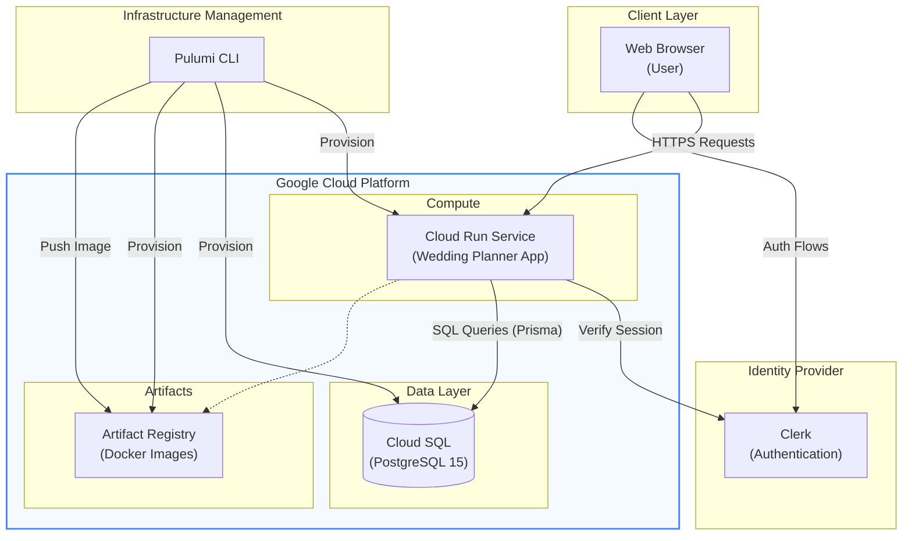

# Application Architecture

This document describes the high-level architecture of the Wedding Planner application and its cloud infrastructure.

## System Overview

The Wedding Planner is a full-stack web application built with **Next.js**, deployed on **Google Cloud Platform (GCP)**, and managed using **Pulumi** for Infrastructure as Code (IaC).

### Core Components

- **Frontend/Backend**: [Next.js](https://nextjs.org/) (App Router)
  - Host: Google Cloud Run (Serverless Container)
- **Authentication**: [Clerk](https://clerk.com/)
  - Managed external service for user identity and session management.
- **Database**: [PostgreSQL](https://www.postgresql.org/)
  - Host: Google Cloud SQL
  - ORM: [Prisma](https://www.prisma.io/)
- **Infrastructure**: [Pulumi](https://www.pulumi.com/)
  - Language: TypeScript
  - Manages all GCP resources (Cloud Run, Cloud SQL, Artifact Registry).

## Architecture Diagram

## Component Details

### 1. Web Application (Cloud Run)

The core application is a Dockerized Next.js app. It runs in a stateless container on Cloud Run, which automatically scales based on traffic.

- **Scaling**: Autoscaling (0 to N instances).
- **Networking**: Accessible via public HTTPS URL (and custom domain).
- **Configuration**: Environment variables (DATABASE_URL, CLERK_KEYS) injected at runtime.

### 2. Database (Cloud SQL)

Relational data storage using PostgreSQL 15.

- **Connection**: public IP with password authentication (secured via connection string).
- **Persistence**: Persistent storage independent of application container lifecycle.

### 3. Artifact Registry

Stores the Docker images built from the application source code. Cloud Run pulls images from here during deployment and scaling events.

### 4. Infrastructure as Code (Pulumi)

All cloud resources are defined in TypeScript in the `infra/` directory.

- **State**: Managed by Pulumi Service (or local).
- **Execution**: `pulumi up` provisions resources and handles the build/push/deploy pipeline.
